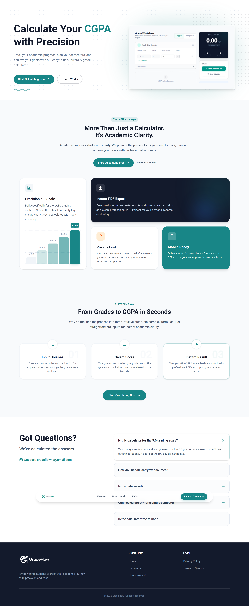
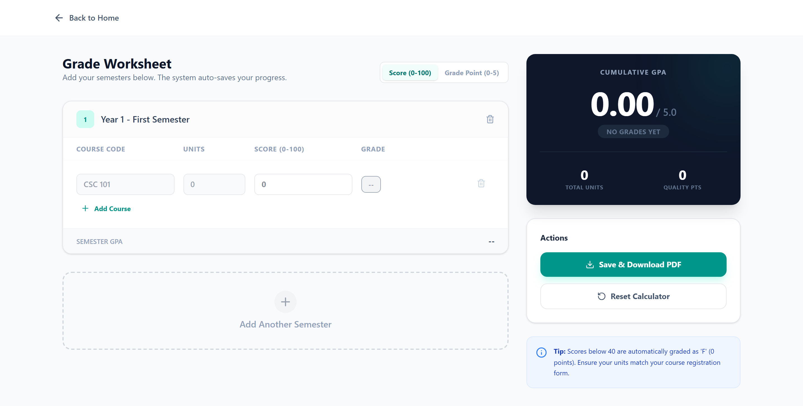
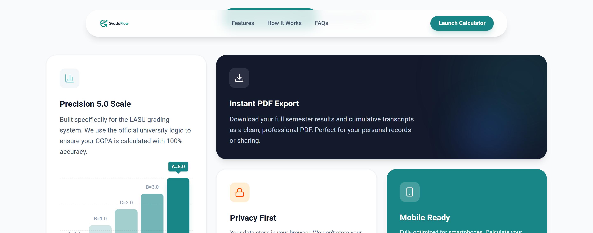
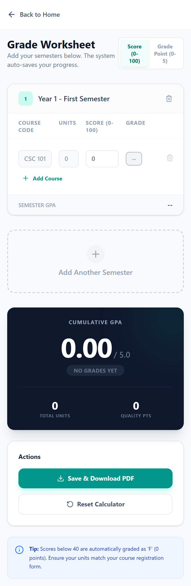
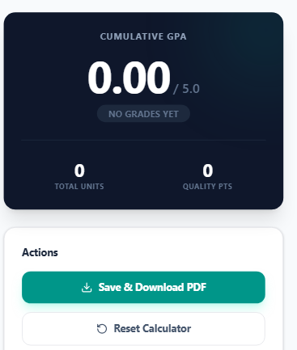

# GradeFlow - LASU CGPA Calculator



**GradeFlow** is a modern, high-precision CGPA calculator designed specifically for students of Lagos State University (LASU). It simplifies the complex process of tracking academic performance by providing an intuitive interface to calculate GPAs and CGPAs based on the university's official 5.0 grading system.

Built with a robust **Java (Javalin)** backend and a dynamic **React** frontend, GradeFlow ensures accuracy, privacy, and a seamless user experience across all devices.

---

## 🚀 Features

### 🎯 Precision 5.0 Scale

-   Implements the official LASU grading logic (A=5.0, B=4.0, etc.).
-   Automatically handles grade points and quality points calculation.
-   Supports both raw scores (0-100) and direct grade point inputs.

### 📊 Dynamic Dashboard

-   **Interactive Calculator**: Add unlimited semesters and courses.
-   **Real-time Updates**: See your GPA and CGPA update instantly as you input grades.
-   **Visual Feedback**: Color-coded grades (Green for A, Red for F) for immediate clarity.

### 📄 PDF Export

-   Generate professional academic reports in seconds.
-   Download a clean, printable PDF of your entire semester results and cumulative standing.

### 🔒 Privacy First

-   **No Database Storage**: All calculations happen in real-time. Your academic data is never stored on our servers.
-   **Local Persistence**: Data is temporarily preserved in your browser session for convenience but remains under your control.

### 📱 Mobile Optimized

-   Fully responsive design that works perfectly on smartphones, tablets, and desktops.
-   "App-like" feel with smooth transitions and touch-friendly controls.

---

## 🛠️ Tech Stack

### Frontend

-   **React 19**: For building a dynamic, component-based user interface.
-   **Vite**: Next-generation frontend tooling for lightning-fast builds.
-   **Tailwind CSS**: Utility-first CSS framework for modern, responsive styling.
-   **Framer Motion**: For "Award-winning" smooth scroll animations and page transitions.
-   **Lucide React**: Beautiful, consistent icons.

### Backend

-   **Java 17**: Robust, strongly-typed language for core logic.
-   **Javalin**: Lightweight web framework for creating a fast, simple REST API.
-   **Maven**: Dependency management and build automation.

### Deployment

-   **Docker**: Containerization for consistent deployment environments.
-   **Render**: Cloud hosting platform for seamless delivery.

---

## 🧩 OOP Design & Architecture

The core calculation logic is built using **Object-Oriented Programming (OOP)** principles in Java, ensuring modularity and maintainability.

### Key Classes

#### 1. `Student.java`

Represents the user. It holds a list of semesters and calculates the final Cumulative Grade Point Average (CGPA).

```java
public class Student {
    private List<Semester> semesters = new ArrayList<>();
    private double cgpa;

    public void calculateCGPA() {
        double totalPoints = 0;
        int totalUnits = 0;
        for (Semester sem : semesters) {
            for (Course c : sem.getCourses()) {
                totalPoints += c.getQualityPoint();
                totalUnits += c.getCreditUnits();
            }
        }
        this.cgpa = totalUnits > 0 ? totalPoints / totalUnits : 0.0;
    }
}
```

#### 2. `Semester.java`

Represents a single academic term. It aggregates courses and calculates the Grade Point Average (GPA) for that specific term.

```java
public class Semester {
    private List<Course> courses = new ArrayList<>();
    private double gpa;

    public void calculateGPA() {
        // Sums quality points of all courses and divides by total units
    }
}
```

#### 3. `Course.java`

The fundamental unit. It encapsulates the logic for converting a raw score (e.g., 72) into a grade (A) and a grade point (5.0).

```java
public class Course {
    private double score;
    private int gradePoint;

    private void calculateGrade() {
        if (score >= 70) { grade = "A"; gradePoint = 5; }
        else if (score >= 60) { grade = "B"; gradePoint = 4; }
        // ... handles all LASU grading rules
    }
}
```

---

## 📸 Screenshots

|          Calculator interface           |         Features Interface          |
| :-------------------------------------: | :---------------------------------: |
|  |  |

|            Mobile View            |          PDF Report           |
|   |   |

---

## 💻 Installation & Local Development

Follow these steps to run GradeFlow locally on your machine.

### Prerequisites

-   **Java JDK 17** or higher
-   **Node.js 18** or higher
-   **Maven**

### 1. Clone the Repository

```bash
git clone https://github.com/oladosuabayomi/GradeFlow.git
cd GradeFlow
```

### 2. Build the Frontend

Navigate to the frontend directory, install dependencies, and build the static assets.

```bash
cd cgpa-frontend
npm install
npm run build
```

_This will generate a `dist` folder containing the compiled React app._

### 3. Prepare Backend Resources

Copy the built frontend files to the Java backend's resource folder so Javalin can serve them.

```bash
# From the project root
cp -r cgpa-frontend/dist/* src/main/resources/public/
```

### 4. Run the Application

Use Maven to compile and run the Java server.

```bash
mvn clean package
java -jar target/cgpa-calculator-1.0-SNAPSHOT.jar
```

Visit `http://localhost:7000` in your browser.

---

## 🤝 Contribution

We welcome contributions to make GradeFlow even better!

1.  **Fork** the repository.
2.  Create a new **Branch** (`git checkout -b feature/AmazingFeature`).
3.  **Commit** your changes (`git commit -m 'Add some AmazingFeature'`).
4.  **Push** to the branch (`git push origin feature/AmazingFeature`).
5.  Open a **Pull Request**.

---

## 📜 License

This project is licensed under the MIT License - see the [LICENSE](LICENSE) file for details.

---

<div align="center">
  Made with ❤️ for All Students
</div>
